<script>
$(document).ready(function() {
  $items = $('div#TOC li');
  $items.each(function(idx) {
    num_ul = $(this).parentsUntil('#TOC').length;
    $(this).css({'text-indent': num_ul * 10, 'padding-left': 0});
  });

});
</script>

```{r setup, include=FALSE}
knitr::opts_chunk$set(echo = TRUE)
```

What's New
---------------

- Version 0.1.x is available as an R package, available through GitHub (https://github.com/haimbar/RCMap).
- The group of sorters is no longer required to be the same as the group of raters.
- The input data is now expected as four plain-text CSV files (see details below).
- The user-interface is implemented as command line hierarchical menus.
- Bivariate plots and analyses are now possible not just to compare different rating variables, but also to compare any combinations of cohorts and rating variables. For example, "managers/importance vs. engineers/feasibility", or "managers/importance vs. managers/feasibility".
- A split-half analysis option has been added.
- A "misplacement index" has been added (similar idea to the bridging/anchoring index in the literature, but a different formula is used.)
- The old "pattern matching" plot is now called "parallel coordinates" and it is possible to compare the average ratings of more than two cohort/variable combinations.
- For each quantitative demographic variable, X, RCMap automatically creates a binary variable X > median(X). See more details below.
- For clustering, the user can now choose any method available via the hclust function (not just ward.D2).
- There are two methods to choose the number of clusters automatically - one based on minimizing the within-cluster sums of squares and the other based on the average silhouette, both are obtained from the function factoextra::fviz_nbclust.
- The user can choose between the Euclidean distance and the hyperbolic distance in order to perform the clustering in the two-dimensional MDS plot.
- A new dot-chart option is now available.
- Dendrograms are now available in colors by cluster.
- There is also a new visualization as a phylogenic tree.
- More detailed error checking (including checking if there are "lumpers".)
- New layout for the average rating per statements and clusters is available.
- The user can choose between two color schemes for plots.


Introduction
---------------

RCMap is an open-source concept mapping software, implemented in R [@R]. It provides a menu-driven user interface to guide users through the concept mapping analytical process [@TROCHIM2017166]. 

This document provides information on the required format of the input data, the installation process, and the graphical and analytical capabilities of RCMap.

RCMap [@BAR2017284] is user-friendly and does not require any programming experience. It can be used to generate cluster maps, point rating, cluster rating maps, pattern matching, go-zone plots, as well as several other types of plots.
It can also be used to generate detailed reports with statistical analyses. Windows users can generate Windows Metafile formatted plots which can be edited in Microsoft Word and PowerPoint, in order to manually adjust various features to achieve the best visual results. Details about the plots, reports, and features appear in the sections below.

The RCMap homepage is https://github.com/haimbar/RCMap https://haim-bar.uconn.edu/software/RCMap/ .
For questions, comments, and suggestions, please contact <a href="mailto:haim.bar@uconn.edu">Haim Bar</a>.


To cite RCMap, use
<br>Bar, Haim, and Lucas Mentch. 2017. "RCmap, an Open-Source Software for 
Concept Mapping." Evaluation and Program Planning 60: 284-92.
doi:10.1016/j.evalprogplan.2016.08.018
and to cite the latest version of the package with BibTeX, use citation("RCMap")
```
@Manual{,
    title = {RCMap: Group Concept Mapping},
    author = {Haim Bar},
    year = {2022},
    note = {R package version 0.1.4},
}
```

Installing and starting RCMap
---------------

To use RCMap, you must first install R (version >= 4.0.0) [@R] which
is available from https://www.r-project.org/ .

RCMap requires the following packages:

- smacof - for multidimensional scaling [@smacof],[@smacof2].
- factoextra - for obtaining a recommended number of clusters [@factoextra].
- crayon - for terminal colors [@crayon].
- ape - for drawing a phylogenic tree [@ape].

Follow the installation instruction of R, and start R (version > 0.1.x no longer requires RStudio - any integrated development environment, or IDE, will do.) From the R console install the RCMap library. It will install the required libraries. You can do it by cloning the GitHub repo and building the package on your computer, or by using the install_github function (for which you will have to install the devtools package, first.)

```{.inputbox}
devtools::install_github("haimbar/RCMap")
```

<p>
To start RCMap, type the following in the R console.

```{.inputbox}
library(RCMap)
RCMapMenu()
```

It will show the <a id="mainmenu"></a>top-level menu of the package:

```{.outputbox}
RCMap command-line interface.
  Top-level menu 

1: Choose the data folder
2: summary
3: Settings
4: Plots
5: Reports
6: Analysis
7: R prompt

Selection: 
```
The menu choices are described in subsequent sections.

A graphical user interface via a browser is not currently available. The menu-driven approach in this new version of RCMap has the advantage that the user can use built-in options and functions through an intuitive interface, but can also get back to the R prompt and perform any additional operations (for example, creating new variables, plots, or analyses.) This also allows greater flexibility in saving results. For example, plots can be saved to a file using the user's preferred size, and in any format supported by R (pdf, png, jpeg, svg, eps, TIFF, bmp, and on Windows - wmf.)

The Input Data
---------------
<p>
The input data has to be in four CSV (comma separated values) files. Note that the file and column names below are all case-sensitive. An example is provided with the RCMap software for reference.

- **Statements.csv** must have two columns: StatementID and Statement. The statement IDs (first column) are numbers from 1 to N, where N is the number of statements. This sheet must have the field names ("StatementID" and "Statement") in the first line.
- **SortedCards.csv** records the statements in each pile, per sorter. The first column in the sorter ID (again, sequential number from 1 to M, where M is the number of sorters). The second column contains a name of the pile, as given by the sorter. It may be blank, but the column must be included in the sheet. The next columns contain the card numbers that person j put in pile k. Note that each row in this file may have a different number of non-empty cells.
- **Demographics** contains information about the sorters. The first column must be named RaterID and must contain the IDs of all the sorters. The other columns will contain information specific to the experiment. The first row must contain the variable names.
- **Ratings** contains ratings given to each card (statement) by each rater. The first column must be named RaterID (note - they do not have to be the same as the sorter IDs). The second column must be called StatementID and it contains the ID of each card. So, if there are 10 raters and 80 statements, there will be 800 rows in the sheet, plus one row for the header. The rest of the columns will contain any rating variable that the raters have rated. In the provided example, we have Feasibility and Importance. It is required that all rating variables are all on the same scale (1-5).

Most common data-entry problems occur because of one of the following reasons:

- Statements from the same sorter are entered to more than one pile.
- File names or column names within each file are not as specified above.

When a new project is loaded, RCMap checks for any possible issues with the data and provides warning or error messages.

RCMap Menu Options
---------------

<a name="choosingFolder"></a>
<H3>Choose the data folder</H3>

Choosing this item in the <a href="#mainmenu">main menu</a> will open a file manager program, with which the user will select the folder where the four project's input files are found. RCMap will attempt to read the files and create the RCMap dataset. If any errors are encountered, RCMap will show an error message in the console. It will also print any issues concerning the pile sorting data. The possible warnings are

- Sorter x: All cards in one pile!
- Sorter x put more than a third of the cards in one pile
- Sorter x: Each card in its own pile!
- Sorter x did not sort card(s) y, z
- Sorter x put cards y,z in multiple piles

These issues can also be seen via the Summary menu item.

<a name="summary"></a>
<H3>Summary</H3>
This tab includes a short summary of the dataset currently being used.
It contains the following:
<ul>
<li>Data directory.
<li>Number of raters.
<li>Number of statements. 
<li>Any issued encountered in loading the data.
</ul>

For example:

```{.outputbox}
RCMap command-line interface.
Data folder: C:/Project/
Number of sorters: 10
Number of statements: 80
Issues:
Sorter  6  did not sort card(s)  12 
Sorter  10  did not sort card(s)  30 


1: Perform split-half analysis
2: Main menu

Selection: 
```

The Summary top-menu item has two submenu options. By choosing 1, the user can perform a split-half analysis (see below), and choosing 2 (or 0) will take the user back to the top menu.

<H4>Perform split-half analysis</H4>
In order to draw conclusions about stakeholder sorting from the 2-D map we must have an estimate of how reliable or consistent the map is. This is done by checking how much the map varies when we use random subsamples from the set of sorters. 

In one such method which is called `split-half', the sorters are split into two groups, we obtain the 2-D maps for each group and check the correlation between them. A high degree of correlation suggests that the map is reliable and consistent. When concept mapping was first introduced, performing the MDS step was computationally difficult and time consuming, but nowadays this computation is feasible, and we can consider a large sample of split-half partitions. Calculating and averaging all split-half reliabilities is equivalent under some conditions to calculating Cronbach's alpha [@ChoChun].
This approach is similar to the quadratic assignment procedure (QAP) proposed in [@Borgatti]. Whereas [@Borgatti] considers QAP for detecting differences between known subgroups of sorters, the same method can be used to determine map consistency -- if the distances obtained from random assignments into two groups are highly correlated, then the map can be considered reliable and not sensitive to the subsample selection.

We divide the set of sorters into two subsets, perform MDS on each half, and obtain the 2-D distance matrix for each half. We then calculate the correlation between the distance matrices. This is repeated 20 times, and we report the mean correlation coefficient, and provide a plot with all 20 correlation coefficients.


```{.outputbox}
Mean correlation between split halves: 0.54 (using 20 random splits, distance= Euclidean)
```

The mean correlation between the split halves (using 20 random splits) is quite high, which suggests good reliability.

```{r badiffs, echo=FALSE, fig.align='center', cap.align='center', out.width='50%', fig.cap=''}
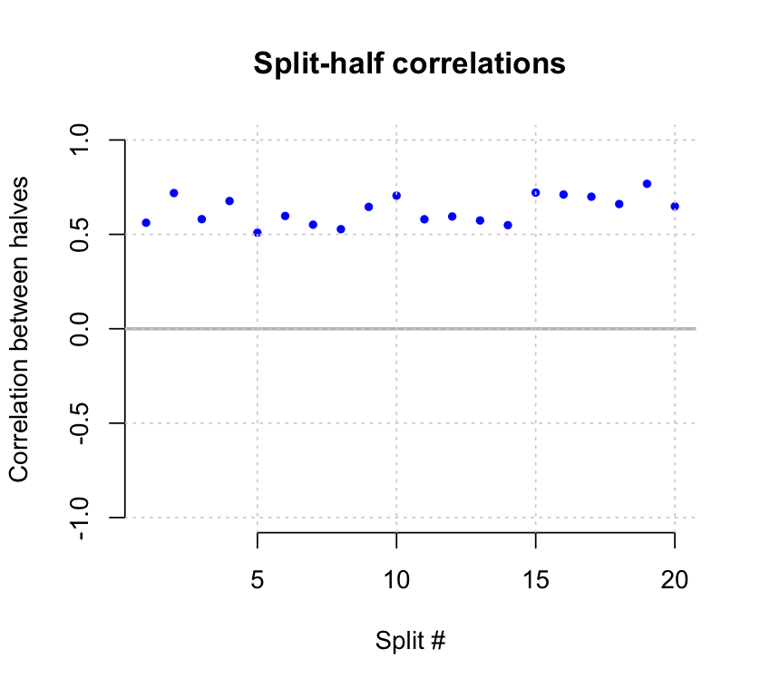
```
<center><B>Split-half reliability with B=20 random splits.</B></center><BR>

<a name="settings"></a>
<H3>Settings</H3>
<p>
This menu option has seven choices:

```{.outputbox}
RCMap command-line interface.
  Settings 

1: Choose the distance metric
2: Choose the clustering method
3: Choose the misplacement index options
4: Choose the number of clusters
5: Set cluster names
6: Choose color scheme
7: Main menu

Selection:
```

<ul>
<li>**Choose the distance metric** The user can choose one of two methods to measure distances between points in the two-dimensional (MDS) plot: Euclidean or hyperbolic (more on the differences between the two will appear separately). 
<li>**Choose the clustering method** The use can choose any clustering method offered by the hclust function in R (ward.D, ward.D2, single, complete, average, mcquitty, median, centroid). In the previous version of RCMap, only the ward.D2 method was available.
<li>**Choose the misplacement index options** The <a href="#mpi">index</a> for each point is calculated by obtaining the difference between the distance to each of the other points in the original high-dimensional space and in the two-dimensional space. If there are S statements, for each one we get S-1 values (the differenece between the distances in the two spaces). The index is a function of these S-1 values, and this function can be the median, the mean, or the maximum (the strictest criterion.)
<li>**Choose the number of clusters**: There are two methods to choose the number of clusters automatically - one based on minimizing the within-cluster sums of squares and the other based on the average silhouette, both are obtained from the function factoextra::fviz_nbclust. Each of the methods also produces a plot which helps to visualize the selection criterion. The third choice is to set the number of clusters manually.
<li>**Set cluster names**: When choosing this option, the user gets a submenu consisting of the current cluster names (dafult values are 1,2,...,k where k is the selected number of clusters.) The use then selects a cluster number and RCMap shows the card names in the selected cluster, as well as the most common labels associated with statements in this clusters (as `suggested names'). See the example below, in a configuration with 17 clusters. The user can then type a cluster name, which will be used in subsequent plots and analyses.
<li>**Choose color scheme**: The user can choose between the RCMap color scheme (for up to 21 clusters) or the rainbow function in R.
</ul>


```{.outputbox}
RCMap command-line interface.
  Select cluster number (or 0 to return to the Settings menu) 

 1: 1    2: 2    3: 3    4: 4    5: 5    6: 6    7: 7    8: 8    9: 9   10: 10
 11: 11   12: 12  13: 13  14: 14  15: 15  16: 16  17: 17  

Selection: 17
17 [ 17 ]
Statements in the cluster
 develop better strategies to learn what other programs are doing
 investigate emerging partnership or new program opportunities
 look for small organizations we might partner with
 find out what our other similar programs are planning to do in our area
Suggested names 
 Partnership
 Expansion
 Outside Industry Context
 Management
 Marketing for the Future

Enter a name [ 17 ]
1: 
```

<a name="plots"></a>
<H3>Plots</H3> 
<p>
The plots menu option gives the following submenu:
```{.outputbox}
RCMap command-line interface.
  Plots 

 1: Point map (MDS)                2: Clusters (rays)             
 3: Clusters (polygons)            4: Dendrogram                  
 5: Phylogenic tree                6: Misplacement                
 7: Statement Rating (Map)         8: Statement Rating (Dot chart)
 9: Cluster Rating (Map)          10: Cluster Rating (Bar chart)  
11: Parallel Coordinates          12: GoZone                      
13: Main menu      

Selection: 
```

<H4>Point Map (MDS)</H4>
<p>
Displays the two-dimensional representation of the distances between statements, as obtained from the MDS (multi-dimensional scaling) algorithm. Statements are labeled on the plot using their number. 

```{r mds, echo=FALSE, fig.align='center', out.width='70%', fig.cap=''}
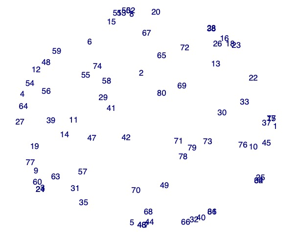
```
<center><B>A point map (MDS).</B></center><BR>

<H4>Clusters</H4>
<p>
Displays the two-dimensional MDS plot, with points grouped into clusters. The number of clusters is determined by the user in the Settings menu option. There are two types of cluster display - Rays, where each point in a cluster is connected to the cluster's center; and Polygons, where clusters appear as convex polygons, with smooth corners.  The default cluster names are number 1,...,k where k is the selected number of clusters. However, the user can choose more descriptive cluster names via the Settings menu.

```{r rays, echo=FALSE,out.width="50%",  out.height="20%",fig.cap="",fig.show='hold',fig.align='center'}
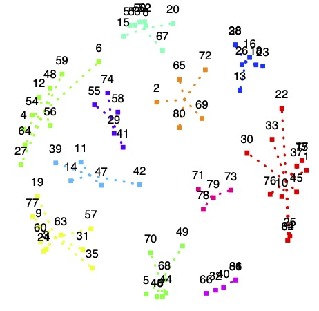
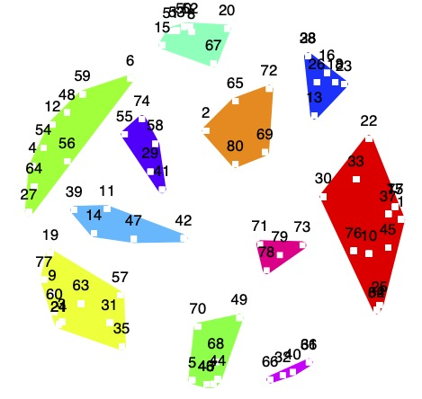
```
<center><B>Cluster plots. Top - rays, bottom - polygons.</B></center><BR>


<h4>Dendrogram  and  Phylogenic tree</h4>
<p>
Following the MDS step, a hierarchical clustering is performed on the two-dimensional representation of the data. In the process, components (statements, or sets of statements) are joined iteratively with their nearest neighbor. The nearest neighbor may be another statement, or a group of statements which were joined into one group in a previous iteration. A dendrogram depicts the hierarchical clustering process. "Leaves" in this binary-tree diagram correspond to the statements, and branches represent the nearest neighbor connections made in each iteration. The length of an edge in a dendrogram is a function of the dis-similarity between joined components. The clusters can also be shown phylogenic trees. Both plots allow users to manually select the preferred number of clusters, based on the lengths of the stems in the tree. The phylogenic tree is more convenient when the number of statements is large, in which case a dendrogram may be too wide for a page.


```{r dendro, echo=FALSE, fig.align='center', out.width='100%', fig.cap=''}
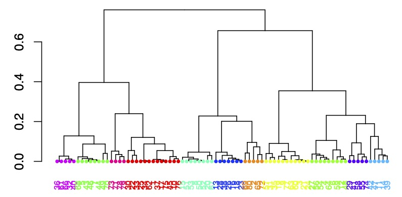
```
<center><B>A dendrogram.</B></center><BR>


```{r phylo, echo=FALSE, fig.align='center', out.width='50%', fig.cap=''}
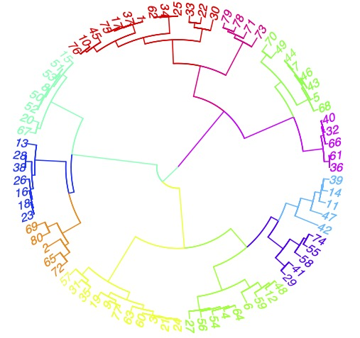
```
<center><B>A phylogenic tree.</B></center><BR>


<a id="mpi"></a><h4>Misplacement Index</h4>
<p>
Based on the user’s choice of a distance metric, RCMap calculates a `misplacement index'. The index is a number between 0 and 1. A small value is assigned to a point which is placed well in the 2-D map in the sense that it appears close in the 2-D map to points to which it was also close in the original space, and it appears far from points which were also far from it in the original space. In other words, a small value corresponds to a point which was projected to the 2-D space so as to preserve its relative distances with the other points. A value close to 1 means that the point's representation in the MDS plot distorts its position (relative to the other points) in the original space.

The following figure shows the MDS plot, and the radius of each point corresponds to its misplacement index value. This helps to identify potential ‘bridges’ – statements with a large radius which indicate that they were placed on the 2-D map close to points with which they were rarely sorted together, or far from statements with which they were sorted often. In this case, because we used the hyperbolic distance, and the median was chosen as the function in the calculation of the index, the circles are all quite small. If we use the maximum instead, the circles will all be larger. As stated earlier, the maximum function is stricter and is more likely to lead to a determination that a point is a bridge. For the maximum to be small it means that all the components that are used in the calculation of the index are small. For the median to be small it is sufficient that half the components that are used in the calculation of the index are small (so, it is possible that among the other half there are some points which were close to the given point in the original space and far from it in the MDS plot, or visa versa.)


```{r misplacement, echo=FALSE, fig.align='center', out.width='60%', fig.cap=''}
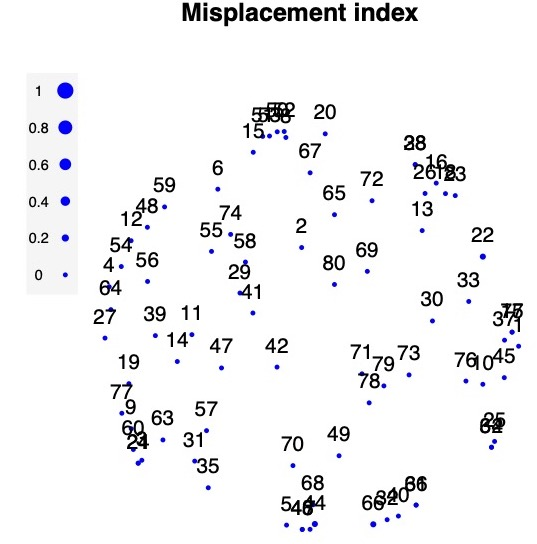
```
<center><B>A misplacement index plot.</B></center><BR>

<h4>Statement Rating - Map and Dot chart</h4>
<p>
After selecting one of the statement rating options the user is prompted to provide a cohort and a rating variable. If a map view is selected, the average ratings of statements for that variable in the selected cohort is shown on the point-map, with point-size proportional to the average rating. The second option is a dot-chart, where the points are shown on a 1-5 scale by cluster, and within each cluster they are shown in increasing rating order (from bottom to top). The dot-chart is useful in identifying statements which rank high or low in one of the rating variables, and to see which clusters contain statements. For example, in the following figure (right) it can be seen that the cluster at the top (red) consists of statements which are considered less feasible by the raters.

```{.outputbox}
1: allRaters
2: CompanySize_large
3: CompanySize_medium
4: CompanySize_small
5: Years_H
6: Years_L

Selection: 1
Rating variable 

1: Feasibility
2: Importance

Selection:
```

```{r statementratingmap, echo=FALSE, fig.align='center', out.width='60%', fig.cap=''}
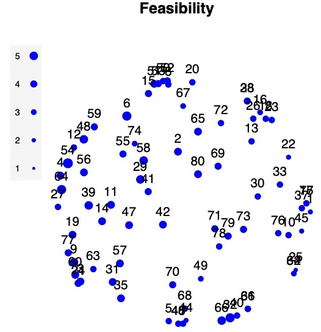
```
<center><B>Average statement ratings as a point map.</B></center><BR>

```{r statementratingdotchart, echo=FALSE, fig.align='center', out.width='80%',  fig.cap=''}
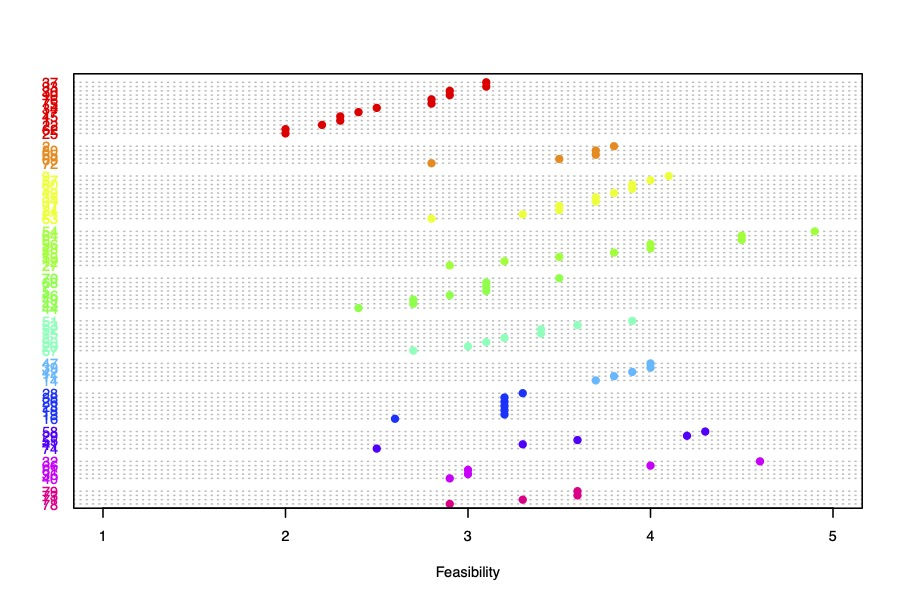
```
<center><B>Average statement ratings as a dotchart.</B></center><BR>

<h4>Cluster Rating - Map and Bar chart</h4>
<p>
Similar to the statement rating plots, but the average ratings are calcualated at the cluster level.The bar chart view shows the average rating per cluster for the selected cohort and variable. The bar plot also includes `whiskers' corresponding to the standard error of the mean.


```{r clusterratingmap, echo=FALSE, fig.align='center', out.width='70%', fig.cap=''}
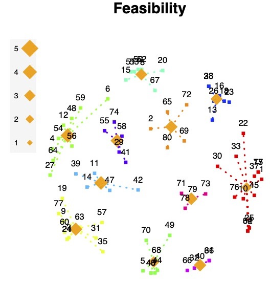
```
<center><B>Average statement ratings as a point map.</B></center><BR>

```{r clusterbarchart, echo=FALSE, fig.align='center', out.width='70%', fig.cap=''}
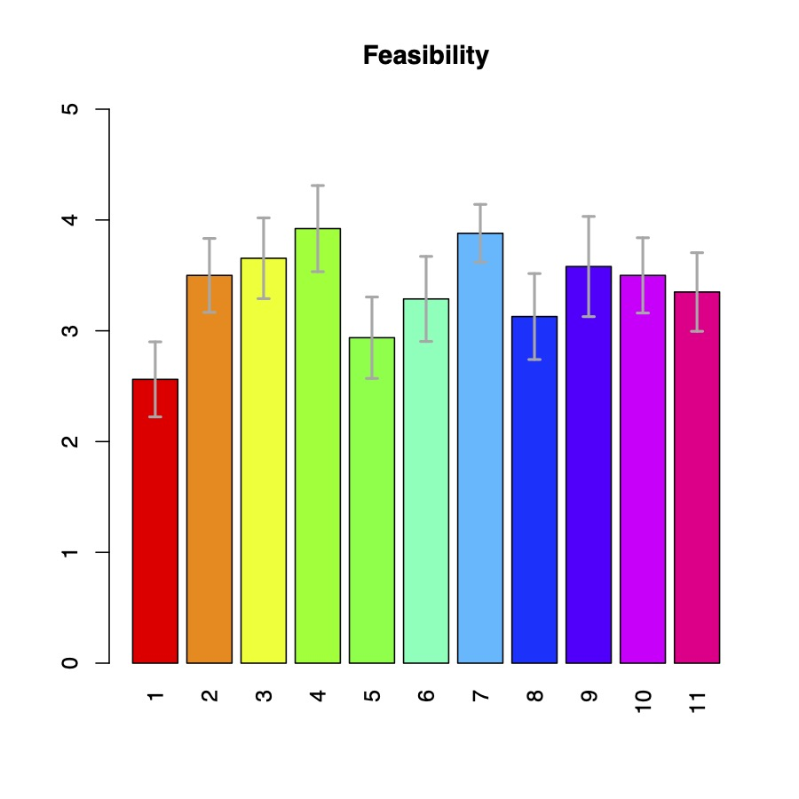
```
<center><B>Average cluster ratings as a barplot.</B></center><BR>

<h4>Parallel Coordinates</h4>
<p>
It is possible to compare average cluster ratings by cohort and rating variables by using a parallel coordinate plot (also known in the concept mapping literature as pattern matching). In this version of RCMap it is possible to use more that two cohort/rating variable combinations. For example, the following figure shows the relationships between feasibility ratings by the three company sizes. It is possible for example to visualize how clusters are rated in terms of feasibility by engineers vs. how they are rated in terms of importance by managers.

```{r parallelplot, echo=FALSE, fig.align='center', out.width='100%', fig.cap=''}
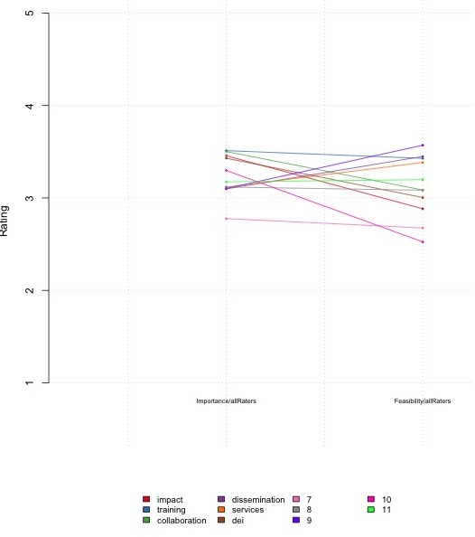
```
<CENTER><B>A parellel coordinates plot.</B></CENTER><BR>

<h4>Go-Zone</h4>
<p>
A bivariate plot is used to show the rating of the statements based on combinations of a rating variable and a cohort. Each statement is represented by a point, allowing to see very easily how points are evaluated by users on both axes, simultaneously. For example, if the variables are Importance and Feasibility, points in the upper-right corner are considered highly important and also very feasible. Each point is also colored by the cluster to which it belongs, allowing to see which clusters rate higher on each dimension. The plot is divided into quadrants, defined by the overall mean ratings along each axis.

```{r gozone1, echo=FALSE, fig.align='center', out.width='60%', fig.cap=''}
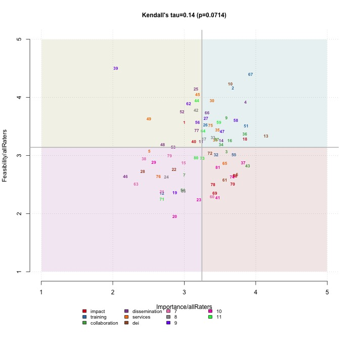
```
<CENTER><B>GoZone plot – comparing the feasibility and importance ratings using all the raters.</B></CENTER><BR>

Another example shows the average statement feasibility ratings by the Years variable (L vs. H, where L and H correspond to below/above the median Years, respectively.) Go-zones are very useful for planning purposes, as they highlight which specific statements rank highest on two dimensions, thus helping stakeholders to prioritize action-items, either by individual statements or by cluster. The ability to view this plot by group can be particularly helpful in planning and evaluating.
```{r gozone2, echo=FALSE, fig.align='center', out.width='60%', fig.cap=''}
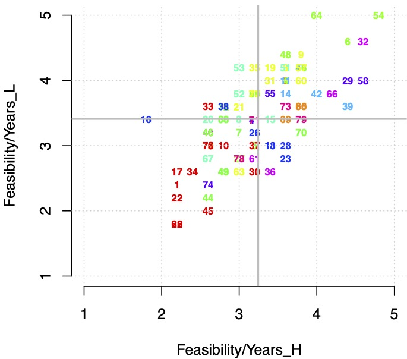
```
<CENTER><B>GoZone plot – comparing the feasibility ratings by the Years variable (L and H correspond to below/above the median Years, respectively.</B></CENTER><BR>


<a name="reportsTab"></a>
<H3>Reports</H3>
<p>
Choosing the Reports item from the top-menu gives the following submenu:

```{.outputbox}
RCMap command-line interface.
  Report 

1: Sorters
2: Raters
3: Statements
4: Main menu      

Selection: 
```

<BR>

<H4>Sorters</H4>
<p> The Sorters report shows for each sorter the number of statements sorted,
and the number of piles to which they were placed. Note that some sorters may
leave some cards unsorted.

```{.outputbox}
Sorter 1 sorted 80 cards into 13 piles
Sorter 2 sorted 80 cards into 20 piles
Sorter 3 sorted 80 cards into 11 piles
Sorter 4 sorted 80 cards into 12 piles
Sorter 5 sorted 80 cards into 10 piles
Sorter 6 sorted 79 cards into 12 piles
Sorter 7 sorted 80 cards into 12 piles
Sorter 8 sorted 80 cards into 13 piles
Sorter 9 sorted 80 cards into 13 piles
Sorter 10 sorted 79 cards into 8 piles

Press any key to continue. 
```

<BR> 

<H4>Raters</H4>
<p>
The raters summary contains summary statistics from the rater demographics file. For categorical variables the report includes the total count for each factor level, and for a quantitative variable it shows the five number summary (minimum, the three quartiles and the maximum), as well as the mean. For example:

```{.outputbox}
 CompanySize     Years      
 large :3    Min.   :0.500  
 medium:2    1st Qu.:2.775  
 small :5    Median :5.700  
             Mean   :5.350  
             3rd Qu.:7.950  
             Max.   :9.900  
Press any key to continue. 
```

<BR> 

<H4>Statements</H4>
<p> 
The statement summary is saved to a file called ‘output/StatementSummaryNN.csv’ where NN is the selected number of clusters. The file contains the statements, their IDs, the cluster to which they belong, and for each rating variable it contains the number of raters, the mean, the standard deviation, the minimum and the maximum. The file is arranged by clusters and the summary statistics for each cluster are also included. The file can be viewed with Excel.

<a name="analysisTab"></a>
<H3>Analysis</H3>
<BR>
<p>Because RCMap runs from R's command line interface, it can be used to perform any statistical method available in R to analyze the ratings.  There are two types of analysis that are included in the RCMap analysis menu. The first one is Analysis of Variance (ANOVA) to determine whether there are different average ratings in different clusters, and the other one is Tukey’s method to perform all pairwise comparisons between clusters. 
Choosing the Analysis item from the top menu gives the following:

```{.outputbox}
RCMap command-line interface.
  Analysis 

1: Between-cluster ANOVA
2: Tukey - all cluster pairs
3: Main menu

Selection: 
```

<H4>Between-cluster ANOVA</H4>
<p>ANOVA (analysis of variance) is used to test whether all the clusters have the same mean rating or not. A small p-value indicates that at least one cluster has a mean rating which is significantly different. Here is an example of the output from an ANOVA model:

```{.outputbox}
Analysis of Variance: Response= Feasibility 
             Df Sum Sq Mean Sq F value Pr(>F)    
Cluster      10  156.4  15.638   11.78 <2e-16 ***
Residuals   789 1047.8   1.328                   
---
Signif. codes:  0 ‘***’ 0.001 ‘**’ 0.01 ‘*’ 0.05 ‘.’ 0.1 ‘ ’ 1
_______________________________________________________________ 
Analysis of Variance: Response= Importance 
             Df Sum Sq Mean Sq F value Pr(>F)
Cluster      10    8.1  0.8119   0.538  0.864
Residuals   789 1191.4  1.5099               
_______________________________________________________________ 
```

The results are displayed on the screen, and are also saved in a file in the output folder in the project's directory. The file name is output/ANOVAnn.txt where nn is the selected number of clusters. In this example we see that the 11 clusters do not have different importance ratings, but not all the clusters have the same feasibility ratings.


<H4>Tukey - all cluster pairs</H4>
<p>Tukey's method allows to perform pairwise comparison between all possible pairs, while controlling the overall pobability of Type I error.
A partial output from Tukey's method is provided here below, and it can be seen that clusters 2, 3, and 4 are significantly more feasible that cluster 1, but cluster 5 is not.

```{.outputbox}
Analysis of Variance: Response= Feasibility 
  Tukey multiple comparisons of means
    95% family-wise confidence level

Fit: aov(formula = ratings[, i] ~ Cluster)

$Cluster
               diff         lwr         upr     p adj
2-1    9.384615e-01  0.31938848  1.55753460 0.0000638
3-1    1.093007e+00  0.61105927  1.57495471 0.0000000
4-1    1.360684e+00  0.85055391  1.87081361 0.0000000
5-1    3.759615e-01 -0.15267272  0.90459580 0.4377120
```

The results are saved in a file in the output folder in the project's directory. The file name is output/TukeyNN.txt where NN is the selected number of clusters.

<H3>Quitting the program</H3>
To quit the program, return to the top-level menu, and select option 7, to get back to the R prompt. You can restart RCMap by running RCMapMenu() again, and continue the analysis.
You can use the save.image() function in R in order to save the project analysis in case you plan to resume the analysis at a later time, after you have quit R. 


<hr>

## Citations
