<script>
$(document).ready(function() {
  $items = $('div#TOC li');
  $items.each(function(idx) {
    num_ul = $(this).parentsUntil('#TOC').length;
    $(this).css({'text-indent': num_ul * 10, 'padding-left': 0});
  });

});
</script>

```{r setup, include=FALSE}
knitr::opts_chunk$set(echo = TRUE)
```

What's New
---------------

**Version 0.3.3 (current)**

- **Console screen clearing fixed for terminal sessions.** The menu header
  function now writes ANSI escape codes (`\033[2J\033[H`) in addition to the
  form-feed character, so the screen is cleared correctly when R is run from
  a macOS or Linux terminal as well as inside RStudio. A new `clear_screen`
  parameter on `RCMapMenu()` (default `TRUE`) allows users to disable screen
  clearing: `RCMapMenu(clear_screen = FALSE)`.

**Version 0.3.2**

- **Adaptive bottom margin in bar plot.** The bottom margin is sized to the
  longest cluster name so that vertical x-axis labels are never truncated.
- **Bottom legend in dendrogram, phylogenic tree, parallel coordinates, and
  Go-Zone plots.** Cluster names previously drawn as text inside or beside the
  plot area are now displayed as a horizontal colour-keyed legend below each
  plot. When the total label width exceeds the figure width the legend wraps to
  multiple rows; the bottom margin grows automatically to fit.

**Version 0.3.1**

- **Cluster names in statement report.** The `StatementSummaryNN.csv` file now
  includes a `ClusterName` column as its last column, showing the user-assigned
  cluster name for every statement row in addition to the `ClusterNo` integer.
- **Cluster names in ANOVA and Tukey output.** The ANOVA table and Tukey HSD
  post-hoc pairwise comparisons now use user-assigned cluster names as factor
  labels (e.g. `"Health-Education"` instead of `"2-1"`). When no names have
  been assigned the cluster index is used as before.

**Version 0.3.0**

- **Fuzzy pile label matching.** Pile labels entered by different sorters are automatically grouped using Jaro-Winkler fuzzy string matching, so typographical variants such as "Health", "helath", and "hlth" are merged into a single canonical form before cluster name suggestions are generated. The matching threshold and other parameters are configurable (see the [Project Configuration File](#configfile) section).
- **Edit canonical pile labels.** A new Settings menu option (option 5) lets users view all canonical labels alongside the original labels from which they were derived. Labels that were automatically merged are highlighted in yellow. Any canonical label can be renamed interactively, and changes are saved immediately.
- **Project configuration file (`config.txt`).** On first load RCMap automatically creates a `config.txt` file in the project folder containing all tunable settings with their defaults and descriptions. If the file already exists only missing settings are appended; existing user-specified values are never overwritten. See the [Project Configuration File](#configfile) section for the complete list of settings.
- **Graceful rater ID mismatch handling.** If a rater appears in the ratings file but not in the demographics file, a warning is shown and the analysis continues (rather than aborting). If a rater appears in the demographics file but has no rating data, they are automatically excluded and a warning is displayed.
- **Non-consecutive IDs supported.** Statement IDs, sorter IDs, and rater IDs no longer need to be consecutive integers; any unique numeric or character identifiers are accepted.
- **Error recovery in folder selection.** If the selected data folder is missing required files, an error message is displayed and the program returns to the main menu instead of terminating.
- **Configurable seeds and analysis parameters.** The random seed for MDS jitter, the split-half random seed, the number of split-half replications, and the Jaccard instability threshold are all now read from `config.txt` and stored in the session, making analyses fully reproducible and customisable without code changes.

**Version 0.2.x**

- Version 0.2.x is available as an R package, available through GitHub (https://github.com/haimbar/RCMap).
- The group of sorters is no longer required to be the same as the group of raters.
- The input data is now expected as four plain-text CSV files (see details below).
- The user-interface is implemented as command line hierarchical menus.
- Bivariate plots and analyses are now possible not just to compare different rating variables, but also to compare any combinations of cohorts and rating variables. For example, "managers/importance vs. engineers/feasibility", or "managers/importance vs. managers/feasibility".
- A split-half analysis option has been added.
- A "misplacement index" has been added (similar idea to the bridging/anchoring index in the literature, but a different formula is used.)
- The old "pattern matching" plot is now called "parallel coordinates" and it is possible to compare the average ratings of more than two cohort/variable combinations.
- For each quantitative demographic variable, X, RCMap automatically creates a binary variable X > median(X). See more details below.
- For clustering, the user can now choose any method available via the hclust function (not just ward.D2).
- There are two methods to choose the number of clusters automatically - one based on minimizing the within-cluster sums of squares and the other based on the average silhouette, both are obtained from the function factoextra::fviz_nbclust.
- The user can choose between the Euclidean distance and the hyperbolic distance in order to perform the clustering in the two-dimensional MDS plot.
- A new dot-chart option is now available.
- Dendrograms are now available in colors by cluster.
- There is also a new visualization as a phylogenic tree.
- More detailed error checking (including checking if there are "lumpers".)
- New layout for the average rating per statements and clusters is available.
- The user can choose between two color schemes for plots.


Introduction
---------------

RCMap is an open-source concept mapping software, implemented in R [@R]. It provides a menu-driven user interface to guide users through the concept mapping analytical process [@TROCHIM2017166]. 

This document provides information on the required format of the input data, the installation process, and the graphical and analytical capabilities of RCMap.

RCMap [@BAR2017284] is user-friendly and does not require any programming experience. It can be used to generate cluster maps, point rating, cluster rating maps, pattern matching, go-zone plots, as well as several other types of plots.
It can also be used to generate detailed reports with statistical analyses. Windows users can generate Windows Metafile formatted plots which can be edited in Microsoft Word and PowerPoint, in order to manually adjust various features to achieve the best visual results. Details about the plots, reports, and features appear in the sections below.

The RCMap homepage is [https://github.com/haimbar/RCMap](https://haim-bar.uconn.edu/software/RCMap/) .
For questions, comments, and suggestions, please contact <a href="mailto:haim.bar@uconn.edu">Haim Bar</a>.


To cite RCMap, use
<br>Bar, Haim, and Lucas Mentch. 2017. "RCmap, an Open-Source Software for 
Concept Mapping." Evaluation and Program Planning 60: 284-92.
doi:10.1016/j.evalprogplan.2016.08.018
and to cite the latest version of the package with BibTeX, use citation("RCMap")
```
@Manual{,
    title = {RCMap: Group Concept Mapping},
    author = {Haim Bar},
    year = {2026},
    note = {R package version 0.3.3},
}
```

Installing and starting RCMap
---------------

To use RCMap, you must first install R (version >= 4.0.0) [@R] which
is available from https://www.r-project.org/ .

RCMap requires the following packages:

- smacof - for multidimensional scaling [@smacof],[@smacof2].
- factoextra - for obtaining a recommended number of clusters [@factoextra].
- crayon - for terminal colors [@crayon].
- ape - for drawing a phylogenic tree [@ape].
- tcltk - for the function tk_choose.dir, used when choosing a project folder.
- stringdist - for fuzzy pile label matching (Jaro-Winkler distance).

Follow the installation instructions for R, and start R (from version > 0.1.x it is no longer required to use RStudio - any integrated development environment, or IDE, or even a simple command line shell will do.) From the R console install the RCMap library. It will install the required libraries. You can do it by cloning the GitHub repo and building the package on your computer, or by using the install_github function (for which you will have to install the devtools package, first.)

```{.inputbox}
devtools::install_github("haimbar/RCMap")
```

<p>
To start RCMap, type the following in the R console.

```{.inputbox}
library(RCMap)
RCMapMenu()
```

It will show the <a id="mainmenu"></a>top-level menu of the package:

```{.outputbox}
RCMap command-line interface.
  Top-level menu 

1: Choose the data folder
2: summary
3: Settings
4: Plots
5: Reports
6: Analysis
7: R prompt

Selection: 
```
The menu choices are described in subsequent sections.

A graphical user interface via a browser is not currently available. The menu-driven approach in recent versions of RCMap has the advantage that the user can use built-in options and functions through an intuitive interface, but can also get back to the R prompt and perform any additional operations (for example, creating new variables, plots, or analyses.) This also allows greater flexibility in saving results. For example, plots can be saved to a file using the user's preferred size, and in any format supported by R (pdf, png, jpeg, svg, eps, TIFF, bmp, and on Windows - wmf.)

The Input Data
---------------
<p>
The input data has to be in four CSV (comma separated values) files. Note that the **file and column names below are all case-sensitive**. An example is provided with the RCMap software for reference.

- **Statements.csv** must have two columns: StatementID and Statement. The statement IDs (first column) must be unique numeric values; they do not need to be consecutive. This sheet must have the field names ("StatementID" and "Statement") in the first line.
- **SortedCards.csv** records the statements in each pile, per sorter. The first column is the sorter ID (unique numeric values; they do not need to be consecutive). The second column contains the name of the pile as given by the sorter — it may be blank, but the column must be present. The next columns contain the card numbers (matching StatementID values) that person j put in pile k. Note that each row in this file may have a different number of non-empty cells. Pile labels from different sorters are automatically matched using fuzzy string comparison so that minor spelling variations are merged into a single canonical label (see [Project Configuration File](#configfile)).
- **Demographics.csv** contains information about the raters. The first column must be named RaterID and must contain the IDs of the raters. The other columns will contain information specific to the experiment. The first row must contain the variable names. Rater IDs do not need to match sorter IDs, and mismatches between the demographics and ratings files are handled gracefully: raters who appear in the ratings file but not in the demographics file produce a warning and are analysed without demographic information; raters who appear in the demographics file but have no rating data are automatically excluded with a warning.
- **Ratings.csv** contains ratings given to each card (statement) by each rater. The first column must be named RaterID (rater IDs do not have to be the same as the sorter IDs, and do not need to be consecutive). The second column must be called StatementID and it contains the ID of each card. So, if there are 10 raters and 80 statements, there will be 800 rows in the sheet, plus one row for the header. The rest of the columns will contain any rating variable that the raters have rated. In the provided example, we have Feasibility and Importance. It is required that all rating variables are on the same scale (1–5 by default; configurable via `config.txt`).

Most common data-entry problems occur because of one of the following reasons:

- Statements from the same sorter are entered to more than one pile.
- File names or column names within each file are not as specified above.

When a new project is loaded, RCMap checks for any possible issues with the data and provides warning or error messages.

RCMap Menu Options
---------------

<a name="choosingFolder"></a>
<H3>Choose the data folder</H3>

Choosing this item in the <a href="#mainmenu">main menu</a> will open a file manager program, with which the user will select the folder where the four project's input files are found. 

The first time the project directory is selected, RCMap will take a few moments to read the data and preprocess it. If the project in the selected directory has already been opened, you should see the following:

```{.outputbox}
RCMap command-line interface.
Opening project folder:XXXX/...

A previous project file was found.
Hit Enter to use saved project, or enter L to load the project from raw files: 
```

RCMap saves your selections (such as the number of clusters, cluster names, etc.) so if you want to pick up where you left off, hit Enter. If you want to reload the data from the original files (for example, if you made updates to the data files), then you should enter **L**.

RCMap will attempt to read the files and create the RCMap dataset. If any errors are encountered, RCMap will show an error message in the console. It will also print any issues concerning the pile sorting data. The possible warnings are

- Sorter x: All cards in one pile
- Sorter x put more than a third of the cards in one pile
- Sorter x: Each card in its own pile
- Sorter x did not sort card(s) y, z
- Sorter x put cards y,z in multiple piles

These issues can also be seen via the Summary menu item.
See more in the Troubleshooting section.

<a name="summary"></a>
<H3>Summary</H3>
This tab includes a short summary of the dataset currently being used.
It contains the following:
<ul>
<li>Data directory.
<li>Number of raters.
<li>Number of statements. 
<li>Any issued encountered in loading the data.
</ul>

For example:

```{.outputbox}
RCMap command-line interface.
Data folder: C:/Project/
Number of sorters: 74
Number of statements: 81
Issues:
Sorter  1  put more than a third of the cards in one pile.
Sorter  4  put more than a third of the cards in one pile.
Sorter  7 did not sort card(s) 56,57,59,61,62,63,64,66,67,68,69,70,72,73,75,76,77,78,79,80,81
...[Truncated]

1: Perform split-half analysis
2: Perform leave-one-out analysis
3: Main menu

Selection: 
```

The Summary top-menu item has three submenu options. By choosing 1, the user can perform a split-half analysis (see below).
Option 2 gives a leave-one out analysus (see details below).
Choosing 3 (or 0) takes the user back to the top menu.

<H4>Perform split-half analysis</H4>
In order to draw conclusions about stakeholder sorting from the 2-D map we must have an estimate of how reliable or consistent the map is. This is done by checking how much the map varies when we use random subsamples from the set of sorters. 

In one such method which is called `split-half', the sorters are split into two groups, we obtain the 2-D maps for each group and check the correlation between them. A high degree of correlation suggests that the map is reliable and consistent. When concept mapping was first introduced, performing the MDS step was computationally difficult and time consuming, but nowadays this computation is feasible, and we can consider a large sample of split-half partitions. Calculating and averaging all split-half reliabilities is equivalent under some conditions to calculating Cronbach's alpha [@ChoChun].
This approach is similar to the quadratic assignment procedure (QAP) proposed in [@Borgatti]. Whereas [@Borgatti] considers QAP for detecting differences between known subgroups of sorters, the same method can be used to determine map consistency -- if the distances obtained from random assignments into two groups are highly correlated, then the map can be considered reliable and not sensitive to the subsample selection.

We divide the set of sorters into two subsets, perform MDS on each half, and obtain the 2-D distance matrix for each half. We then calculate the correlation between the distance matrices. This is repeated 20 times, and we report the mean correlation coefficient, and provide a plot with all 20 correlation coefficients.


```{.outputbox}
Mean correlation between split halves: 0.64 (using 20 random splits, distance= Euclidean)
```

The mean correlation between the split halves (using 20 random splits) is quite high, which suggests good reliability.

```{r badiffs, echo=FALSE, fig.align='left', cap.align='center', out.width='60%', fig.cap=''}
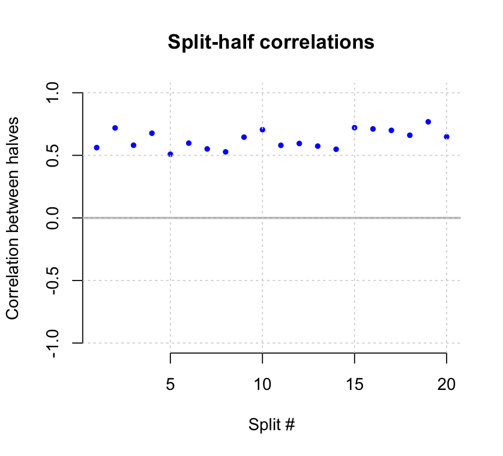
```
<center><B>Split-half reliability with B=20 random splits.</B></center><BR>

<H4>Perform leave-one-out analysis</H4>
The clustering is performed on the two-dimensional map obtained from the multidimensional scaling. When high-dimensional data are projcted to a lower dimension, the (scaled) distances between pairs of points may be quite different than they are in the original space. The important question with regard to clustering is whether the multidimensional scaling process affects the clustering. One global measure that is often used is the *stress*. However, it does not tell us what the impact on the clustering is, or which clusters are affected.

Furthermore, it may be that some sorters have a large impact on the final MDS map. The stress measure, or the split-half analysis do not tell us whether such sorters exist, or what impact individual sorters have on the final map.

To provide an answer to these questions, we perform a leave-one-out analysis. If there are M sorters, we perform the MDS step M+1 times: once with all the sorters, and then M more times, each time leaving on sorter out. For each of these M+1 MDS plots, we obtain the clustering for k=2,...,N/4 clusters, where N is the total number of statements.
Then, we calculate the [Jaccard index](https://en.wikipedia.org/wiki/Jaccard_index) for each k, and for each of the M leave-one-out clusterings. The Jaccard index is defined as
$$J=\frac{TP}{TP + FP + FN},$$
where TP is the number of pairs of points that are placed in the same cluster when using all the data, as well as when leaving one sorter out. FP is the number of pairs that are placed in the same cluster when leaving one out but in different clusters when using all the data. Similarly, FN is the number of pairs that are placed in the same cluster when using all the sorters but in different clusters when leaving one sorter out.

The Jaccard index takes values between 0 (no agreement between two clusterings) and 1 (the same clusters were obtained by the two methods.)
The following plot shows an example of such leave-one-out analysis:

```{r jaccard, echo=FALSE, fig.align='left', cap.align='center', out.width='70%', fig.cap=''}
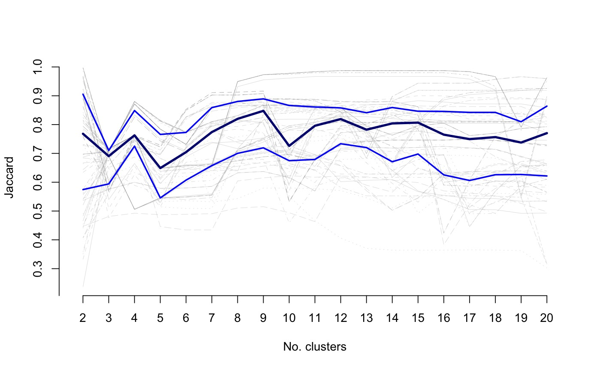
```
<center><B>Leave-one-out analysis.</B></center><BR>

The grey lines in this plot are the Jaccard index values (vertical axis) for each statement, for each number of clusters (horizontal axis.)
The dark black line is the median Jaccard index, and the two blue lines are the first and third quartiles.

What we can see in this example is that the median is maximized when 9 clusters are used. The upper and lower quartiles are also close to their maximum value for k=9, which suggests that nine clusters may give us the most reliable clusters. We can also see that some statements become almost perfectly placed once we get to k=8, but after k=18 the Jaccard index drops.
We also see that a couple of statements get consistent low scores, suggesting that there was at least one sorter who sorted these statements very differently than the consensus.

We say more about this later.


<a name="settings"></a>
<H3>Settings</H3>
<p>
This menu option has six choices:

```{.outputbox}
RCMap command-line interface.
  Settings

1: Choose the distance metric
2: Choose the number of clusters
3: Set cluster names
4: Choose color scheme
5: Edit pile label canonical names
6: Main menu

Selection:
```

<ul>
<li>**Choose the distance metric** The user can choose one of two methods to measure distances between points in the two-dimensional (MDS) plot: Euclidean or hyperbolic (more on the differences between the two will appear separately). The default metric can also be set in `config.txt` (see [Project Configuration File](#configfile)).
<li>**Choose the number of clusters**: There are two methods to choose the number of clusters automatically - one based on minimizing the within-cluster sums of squares and the other based on the average silhouette, both are obtained from the function factoextra::fviz_nbclust. Each of the methods also produces a plot which helps to visualize the selection criterion. The third choice is to set the number of clusters manually, which the user can do by interpreting the Jaccard index plot, for example. The initial number of clusters can be set in `config.txt`.
<li>**Set cluster names**: When choosing this option, the user gets a submenu consisting of the current cluster names (default values are 1, 2, ..., k where k is the selected number of clusters). The user then selects a cluster number and RCMap shows the card names in the selected cluster, as well as the most common canonical labels associated with statements in that cluster (as "suggested names"). See the example below, in a configuration with 17 clusters. The user can then type a cluster name, which will be used in subsequent plots and analyses.
<li>**Choose color scheme**: The user can choose between the RCMap color scheme (for up to 21 clusters) or the rainbow function in R. The default can also be set in `config.txt`.
<li>**Edit pile label canonical names**: Displays the full list of canonical pile labels — labels that have been standardized from the raw labels entered by sorters. Labels that were automatically merged from multiple similar originals (e.g. "health", "helath", "hlth" → "health") are highlighted in yellow, and the original variants are shown in brackets. The user can select any canonical label and type a new name for it; the change is applied immediately to both the in-memory session and the saved project files.
</ul>

<br>
Here is an example of the menu option for cluster name selection. Here, the number of clusters (11) was selected by minimizing the within-cluster sums of squares. It includes the top labels, and extracts some suggested cluster names. For example, based on sorter-provided labels, four of the top five suggestions include collaboration or community.
The output has been truncated for brevity.

```{.outputbox}
RCMap command-line interface.
  Select cluster number (or 0 to return to the main menu) 

 1: 1    2: 2    3: 3    4: 4    5: 5    6: 6    7: 7    8: 8    9: 9 
10: 10  11: 11  

Selection: 3
3 [ 3 ]
Statements in the cluster 
Institutional collaboration and commitment to clinical...
Number and types of CTSA Hub interactions with state...
Number and types of new or ongoing collaborations with...
Number, type, duration, and quality of Hub-supported community...
Number and types of collaborative research projects and collaborators...
Number and types of Hub collaborations with community members...
...[Truncated]

Suggested names 
collaboration
community engagement
community
team science
collaborations

Enter a name [ 3 ]
1:
```

<a name="configfile"></a>
<H3>Project Configuration File</H3>
<p>
The first time a project folder is loaded, RCMap automatically creates a plain-text file called **`config.txt`** in that folder. The file lists every tunable setting with its current value and a short description. On subsequent loads, any settings already in the file are read and applied; any settings that are missing are appended with their default values. This means you can freely add, remove, or edit lines in the file between sessions — RCMap will never overwrite values you have set.

The following settings are supported:

| Setting | Default | Description |
|---|---|---|
| `ratingscale` | `5` | Number of Likert scale points (e.g. 5 or 7). |
| `clust_method` | `ward.D2` | Hierarchical clustering method passed to `hclust`. Options: `ward.D2`, `ward.D`, `single`, `complete`, `average`, `mcquitty`, `median`, `centroid`. |
| `dist_metric` | `Euclidean` | Initial distance metric for clustering and plots. Options: `Euclidean`, `Hyperbolic`. |
| `color_scheme` | `rcmap` | Initial color scheme for cluster plots. Options: `rcmap`, `rainbow`. |
| `n_clusters` | `3` | Starting number of clusters (can be changed interactively in Settings). |
| `mds_seed` | `154204` | Random seed for the tiny jitter applied to the MDS distance matrix to break ties. Change this only if you need to verify that results are not seed-dependent. |
| `splithalf_seed` | `23456` | Random seed for the split-half reliability analysis. |
| `splithalf_B` | `20` | Number of random splits used in the split-half reliability analysis. |
| `fuzzy_label_threshold` | `0.15` | Jaro-Winkler distance threshold for fuzzy pile label matching. Values closer to 0 require labels to be nearly identical to be merged; values closer to 1 are more aggressive. A value of 0.15 catches most typos and abbreviations while keeping clearly distinct labels separate. |
| `jaccard_threshold` | `0.3` | Jaccard index values below this threshold are considered "unstable" in the leave-one-out stability plot. Statements with consistently low Jaccard values may be misplaced in the 2-D map. |

A typical `config.txt` looks like this:

```{.outputbox}
# RCMap project configuration file
# Edit the values below to override defaults.

# ratingscale: number of Likert scale points (e.g. 5, 7)
ratingscale=5

# clust_method: hierarchical clustering method (...)
clust_method=ward.D2

# dist_metric: initial distance metric for plots (Euclidean, Hyperbolic)
dist_metric=Euclidean

# color_scheme: initial color scheme for plots (rcmap, rainbow)
color_scheme=rcmap

# n_clusters: initial number of clusters
n_clusters=3

# mds_seed: random seed for MDS distance-matrix jitter (reproducibility)
mds_seed=154204

# splithalf_seed: random seed for split-half reliability analysis
splithalf_seed=23456

# splithalf_B: number of split-half replications
splithalf_B=20

# fuzzy_label_threshold: Jaro-Winkler distance threshold for pile label
# fuzzy matching (0-1, lower = stricter)
fuzzy_label_threshold=0.15

# jaccard_threshold: Jaccard index values below this are flagged as unstable
jaccard_threshold=0.3
```

Lines starting with `#` are comments and are ignored. Values set interactively (such as the number of clusters or cluster names) are saved to `CMapSession.RData` and restored on the next load; they take precedence over the values in `config.txt`.

<a name="plots"></a>
<H3>Plots</H3> 
<p>
The plots menu option gives the following submenu:
```{.outputbox}
RCMap command-line interface.
  Plots 

 1: Point map (MDS)                2: Clusters (rays)             
 3: Clusters (polygons)            4: Dendrogram                  
 5: Phylogenic tree                6: Misplacement                
 7: Statement Rating (Map)         8: Statement Rating (Dot chart)
 9: Cluster Rating (Map)          10: Cluster Rating (Bar chart)  
11: Parallel Coordinates          12: GoZone                      
13: Main menu      

Selection: 
```

<H4>Point Map (MDS)</H4>
<p>
Displays the two-dimensional representation of the distances between statements, as obtained from the MDS (multi-dimensional scaling) algorithm. Statements are labeled on the plot using their number. 

```{r mds, echo=FALSE, fig.align='left', out.width='70%', fig.cap=''}
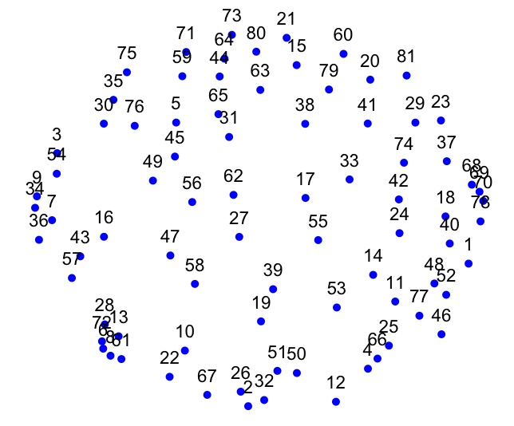
```
<center><B>A point map (MDS).</B></center><BR>

<H4>Clusters</H4>
<p>
The Clusters option displays the two-dimensional MDS plot, with points grouped into clusters. The number of clusters is determined by the user in the Settings menu option. There are two types of cluster display - Rays, where each point in a cluster is connected to the cluster's center; and Polygons, where clusters appear as convex polygons, with smooth corners.  The default cluster names are number 1,...,k where k is the selected number of clusters. However, the user can choose more descriptive cluster names via the Settings menu. Here, we show just the polygon view, and with cluster 3 named "Collaboration".

```{r rays, echo=FALSE,out.width="70%",  out.height="20%",fig.cap="",fig.show='hold',fig.align='left'}
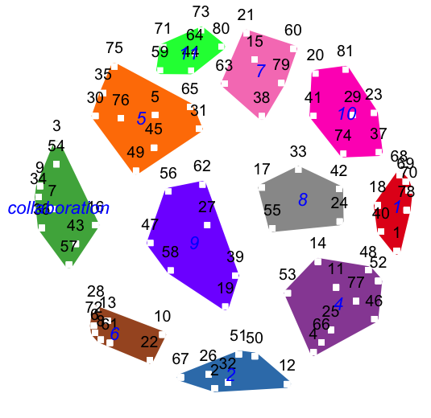
```
<center><B>Cluster plots - polygons.</B></center><BR>


<h4>Dendrogram  and  Phylogenic tree</h4>
<p>
Following the MDS step, a hierarchical clustering is performed on the two-dimensional representation of the data. In the process, components (statements, or sets of statements) are joined iteratively with their nearest neighbor. The nearest neighbor may be another statement, or a group of statements which were joined into one group in a previous iteration. A dendrogram depicts the hierarchical clustering process. "Leaves" in this binary-tree diagram correspond to the statements, and branches represent the nearest neighbor connections made in each iteration. The length of an edge in a dendrogram is a function of the dis-similarity between joined components. The clusters can also be shown phylogenic trees. Both plots allow users to manually select the preferred number of clusters, based on the lengths of the stems in the tree. The phylogenic tree is more convenient when the number of statements is large, in which case a dendrogram may be too wide for a page. Here, we demonstrate just the dendrogram, with 11 clusters.


```{r dendro, echo=FALSE, fig.align='left', out.width='90%', fig.cap=''}
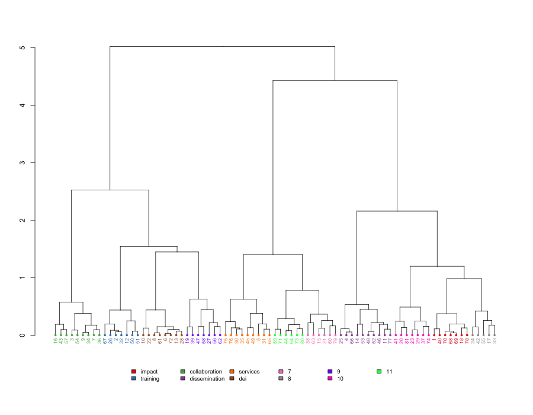
```
<center><B>A dendrogram.</B></center><BR>


<!--
```{r phylo, echo=FALSE, fig.align='left', out.width='50%', fig.cap=''}
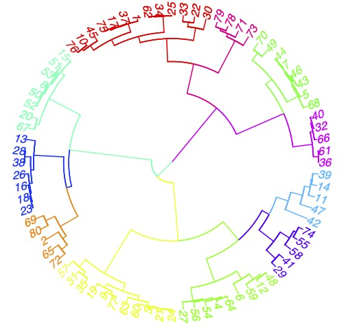
```
<center><B>A phylogenic tree.</B></center><BR>
-->

<a id="mpi"></a><h4>Misplacement</h4>
<p>
Based on the user’s choice of a distance metric, RCMap calculates a 'misplacement index'. The index is a number between 0 and 1. A small value is assigned to a point which is placed well in the 2-D map in the sense that it appears close in the 2-D map to points to which it was also close in the original space, and it appears far from points which were also far from it in the original space. In other words, a small value corresponds to a point which was projected to the 2-D space so as to preserve its relative distances with the other points. A value close to 1 means that the point's representation in the MDS plot distorts its position (relative to the other points) in the original space.

The index is based on the Jaccard index, which we described above in the 'Perform leave-one-out analysis' section. Recall that the Jaccard index of a statement is close to 1 if it is placed in the same cluster with high probability in the leave-one-out process. The misplacement for a given clustering configuration is calculated as the proportion of times that the Jaccard index falls below a certain threshold. A higher value indicates a misplaced point in the 2-D point.

The following figure shows the MDS plot, and the radius of each point corresponds to its misplacement index value. This helps to identify potential ‘bridges’ – statements with a large radius which indicate that they were placed on the 2-D map close to points with which they were rarely sorted together, or far from statements with which they were sorted often. 

For example, point 41 (in cluster #10) has a relatively large value, suggesting that it may not be a good fit for the cluster, in the sense that some sorters put it with statements other than the ones in the same cluster (20, 23, 29, 37, 74, and 81). 

In contrast, the collaboration cluster (with statement 7 close to its center) has very low vaalues of the misplacement index, suggesting that this cluster represents the high-dimensional data rather faithfully.

```{r misplacement, echo=FALSE, fig.align='left', out.width='70%', fig.cap=''}
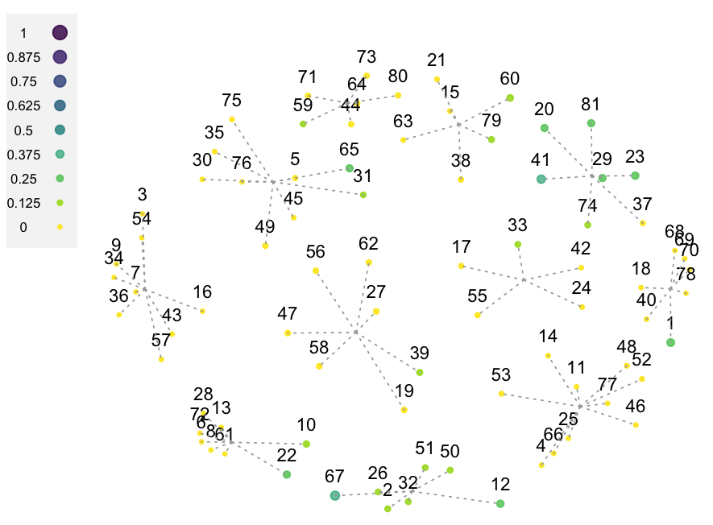
```
<center><B>A misplacement index plot.</B></center><BR>

<h4>Statement Rating - Map and Dot chart</h4>
<p>
After selecting one of the statement rating options the user is prompted to provide a cohort and a rating variable. If a map view is selected, the average ratings of statements for that variable in the selected cohort is shown on the point-map, with point-size proportional to the average rating. The second option is a dot-chart, where the points are shown on a 1-5 scale by cluster, and within each cluster they are shown in increasing rating order (from bottom to top). The dot-chart is useful in identifying statements which rank high or low in one of the rating variables, and to see which clusters contain statements. For example, in the following dot chart it can be seen that  cluster 10 consists of statements which are considered less feasible by the raters.

```{.outputbox}
1: allRaters
 2: X1_Administrator
 3: X1_Community.Partner
 4: X1_Evaluator
 5: X1_KL2.PI
 6: X1_NCATS.Staff
 7: X1_Other..please.specify.below..
 8: X1_Other.CTSA.Hub.Staff
 9: X1_TL1.PI
10: X1_UL1.PI
11: X2___
12: X2_L
13: X2_M
14: X2_S

Selection: 1
Rating variable 

1: Importance
2: Feasibility

Selection:
```

```{r statementratingmap, echo=FALSE, fig.align='left', out.width='80%', fig.cap=''}
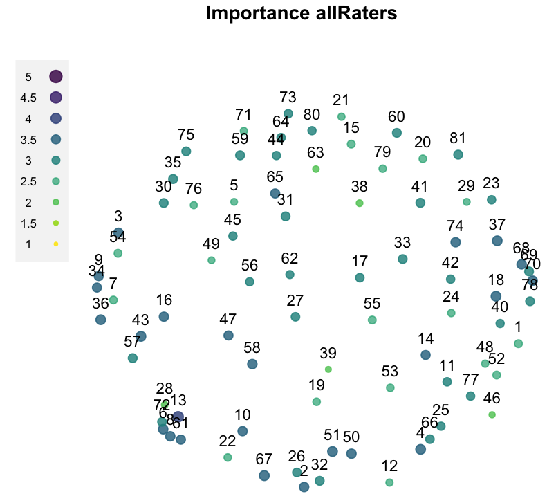
```
<center><B>Average statement ratings as a point map.</B></center><BR>

```{r statementratingdotchart, echo=FALSE, fig.align='left', out.width='80%',  fig.cap=''}
knitr::include_graphics("Figures/Dotchart.png")
```
<center><B>Average statement ratings as a dotchart.</B></center><BR>

<h4>Cluster Rating - Map and Bar chart</h4>
<p>
Similar to the statement rating plots, but the average ratings are calcualated at the cluster level. The bar chart view shows the average rating per cluster for the selected cohort and variable. The bar plot also includes 'whiskers' corresponding to the standard error of the mean.

There are two options to sort the bars in the plot -- alphabetically, or by height. Below, we demonstrate the latter, and we can see that cluster 10 is the least feasible, while cluster 9 is the most feasible.


<!--
```{r clusterratingmap, echo=FALSE, fig.align='left', out.width='70%', fig.cap=''}
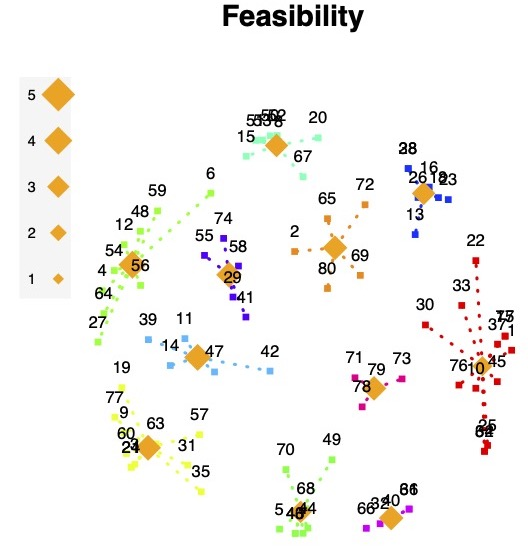
```
<center><B>Average statement ratings as a point map.</B></center><BR>
-->

```{r clusterbarchart, echo=FALSE, fig.align='left', out.width='70%', fig.cap=''}
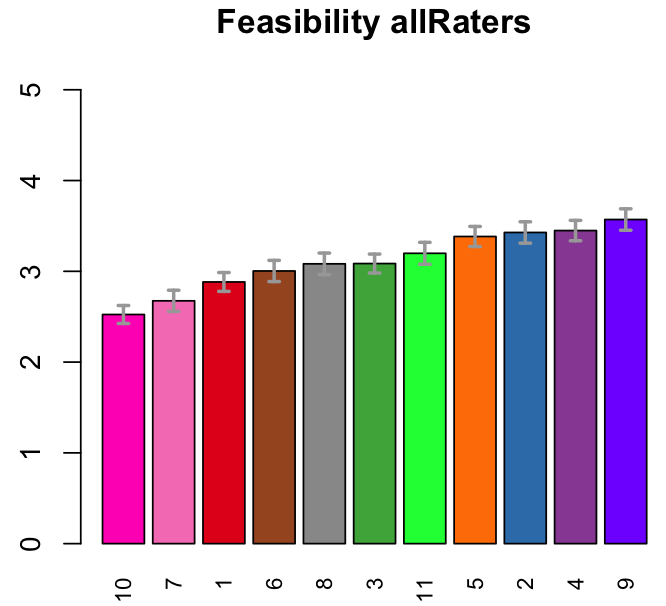
```
<center><B>Average cluster ratings as a barplot.</B></center><BR>

<h4>Parallel Coordinates</h4>
<p>
It is possible to compare average cluster ratings by cohort and rating variables by using a parallel coordinate plot (also known in the concept mapping literature as pattern matching). In this version of RCMap it is possible to use more that two cohort/rating variable combinations. For example, the following figure shows the relationships between feasibility ratings by the three company sizes. It is possible for example to visualize how clusters are rated in terms of feasibility by engineers vs. how they are rated in terms of importance by managers.

```{r parallelplot, echo=FALSE, fig.align='left', out.width='100%', fig.cap=''}
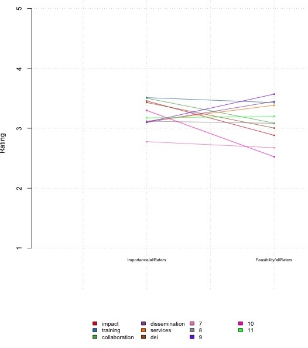
```
<CENTER><B>A parellel coordinates plot.</B></CENTER><BR>

<h4>Go-Zone</h4>
<p>
A bivariate plot is used to show the rating of the statements based on combinations of a rating variable and a cohort. Each statement is represented by a point, allowing to see very easily how points are evaluated by users on both axes, simultaneously. For example, if the variables are Importance and Feasibility, points in the upper-right corner are considered highly important and also very feasible. Each point is also colored by the cluster to which it belongs, allowing to see which clusters rate higher on each dimension. The plot is divided into quadrants, defined by the overall mean ratings along each axis.

```{r gozone1, echo=FALSE, fig.align='left', out.width='60%', fig.cap=''}
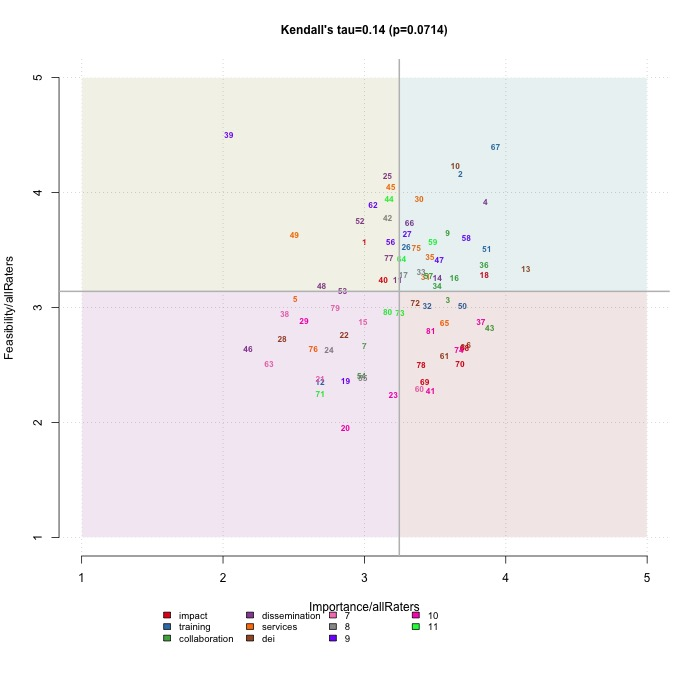
```
<CENTER><B>GoZone plot – comparing the feasibility and importance ratings using all the raters.</B></CENTER><BR>

Another example shows the average statement feasibility ratings by the Years variable (L vs. H, where L and H correspond to below/above the median Years, respectively.) Go-zones are very useful for planning purposes, as they highlight which specific statements rank highest on two dimensions, thus helping stakeholders to prioritize action-items, either by individual statements or by cluster. The ability to view this plot by group can be particularly helpful in planning and evaluating.
```{r gozone2, echo=FALSE, fig.align='left', out.width='60%', fig.cap=''}
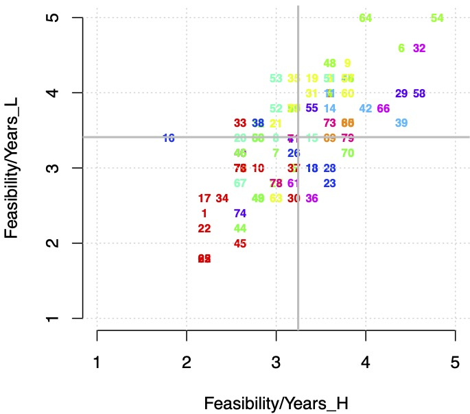
```
<CENTER><B>GoZone plot – comparing the feasibility ratings by the Years variable (L and H correspond to below/above the median Years, respectively.</B></CENTER><BR>


<a name="reportsTab"></a>
<H3>Reports</H3>
<p>
Choosing the Reports item from the top-menu gives the following submenu:

```{.outputbox}
RCMap command-line interface.
  Report 

1: Sorters
2: Raters
3: Statements
4: Main menu      

Selection: 
```

<BR>

<H4>Sorters</H4>
<p> The Sorters report shows for each sorter the number of statements sorted,
and the number of piles to which they were placed. Note that some sorters may
leave some cards unsorted.

```{.outputbox}
Sorter 1 sorted 80 cards into 13 piles
Sorter 2 sorted 80 cards into 20 piles
Sorter 3 sorted 80 cards into 11 piles
Sorter 4 sorted 80 cards into 12 piles
Sorter 5 sorted 80 cards into 10 piles
Sorter 6 sorted 79 cards into 12 piles
Sorter 7 sorted 80 cards into 12 piles
Sorter 8 sorted 80 cards into 13 piles
Sorter 9 sorted 80 cards into 13 piles
Sorter 10 sorted 79 cards into 8 piles

Press any key to continue. 
```

<BR> 

<H4>Raters</H4>
<p>
The raters summary contains summary statistics from the rater demographics file. For categorical variables the report includes the total count for each factor level, and for a quantitative variable it shows the five number summary (minimum, the three quartiles and the maximum), as well as the mean. For example:

```{.outputbox}
 CompanySize     Years      
 large :3    Min.   :0.500  
 medium:2    1st Qu.:2.775  
 small :5    Median :5.700  
             Mean   :5.350  
             3rd Qu.:7.950  
             Max.   :9.900  
Press any key to continue. 
```

<BR> 

<H4>Statements</H4>
<p> 
The statement summary is saved to a file called ‘output/StatementSummaryNN.csv’ where NN is the selected number of clusters. The file contains the statements, their IDs, the cluster to which they belong, and for each rating variable it contains the number of raters, the mean, the standard deviation, the minimum and the maximum. The file is arranged by clusters and the summary statistics for each cluster are also included. The file can be viewed with Excel.

<a name="analysisTab"></a>
<H3>Analysis</H3>
<BR>
<p>Because RCMap runs from R's command line interface, it can be used to perform any statistical method available in R to analyze the ratings.  There are two types of analysis that are included in the RCMap analysis menu. The first one is Analysis of Variance (ANOVA) to determine whether there are different average ratings in different clusters, and the other one is Tukey’s method to perform all pairwise comparisons between clusters. 
Choosing the Analysis item from the top menu gives the following:

```{.outputbox}
RCMap command-line interface.
  Analysis 

1: Between-cluster ANOVA
2: Tukey - all cluster pairs
3: Main menu

Selection: 
```

<H4>Between-cluster ANOVA</H4>
<p>ANOVA (analysis of variance) is used to test whether all the clusters have the same mean rating or not. A small p-value indicates that at least one cluster has a mean rating which is significantly different. Here is an example of the output from an ANOVA model:

```{.outputbox}
Analysis of Variance: Response= Feasibility 
             Df Sum Sq Mean Sq F value Pr(>F)    
Cluster      10  156.4  15.638   11.78 <2e-16 ***
Residuals   789 1047.8   1.328                   
---
Signif. codes:  0 ‘***’ 0.001 ‘**’ 0.01 ‘*’ 0.05 ‘.’ 0.1 ‘ ’ 1
_______________________________________________________________ 
Analysis of Variance: Response= Importance 
             Df Sum Sq Mean Sq F value Pr(>F)
Cluster      10    8.1  0.8119   0.538  0.864
Residuals   789 1191.4  1.5099               
_______________________________________________________________ 
```

The results are displayed on the screen, and are also saved in a file in the output folder in the project's directory. The file name is output/ANOVAnn.txt where nn is the selected number of clusters. In this example we see that the 11 clusters do not have different importance ratings, but not all the clusters have the same feasibility ratings.


<H4>Tukey - all cluster pairs</H4>
<p>Tukey's method allows to perform pairwise comparison between all possible pairs, while controlling the overall pobability of Type I error.
A partial output from Tukey's method is provided here below, and it can be seen that clusters 2, 3, and 4 are significantly more feasible that cluster 1, but cluster 5 is not.

```{.outputbox}
Analysis of Variance: Response= Feasibility 
  Tukey multiple comparisons of means
    95% family-wise confidence level

Fit: aov(formula = ratings[, i] ~ Cluster)

$Cluster
               diff         lwr         upr     p adj
2-1    9.384615e-01  0.31938848  1.55753460 0.0000638
3-1    1.093007e+00  0.61105927  1.57495471 0.0000000
4-1    1.360684e+00  0.85055391  1.87081361 0.0000000
5-1    3.759615e-01 -0.15267272  0.90459580 0.4377120
```

The results are saved in a file in the output folder in the project's directory. The file name is output/TukeyNN.txt where NN is the selected number of clusters.

<H3>Quitting the program</H3>
To quit the program, return to the top-level menu, and select option 7, to get back to the R prompt. You can restart RCMap by running RCMapMenu() again, and continue the analysis.
You can use the save.image() function in R in order to save the project analysis in case you plan to resume the analysis at a later time, after you have quit R. 


<hr>

## Troubleshooting

This section describes the errors and warnings that RCMap may report, their
most common causes, and how to resolve them.

### Errors that stop the analysis

These messages appear in red and halt data loading. After reading the message,
press **Enter** to return to the main menu, correct the problem in your CSV
files, and reload the project.

---

**`Missing required file(s) in '<folder>': ...`**

One or more of the four required CSV files (`Statements.csv`,
`SortedCards.csv`, `Ratings.csv`, `Demographics.csv`) is absent from the
selected project folder. Check that the folder you selected is the correct one
and that all four files are present with exactly these names (case-sensitive).

---

**`'Statements.csv' appears empty or malformed.`**

The file could not be parsed as a two-column CSV.  Make sure it has a header
row with (at least) `StatementID` and `Statement` columns, and that each
subsequent row contains an integer ID and the statement text.

---

**`StatementID column must be numeric.`** /
**`Duplicate StatementID values found.`**

Every row in `Statements.csv` must have a unique integer in the `StatementID`
column. Non-numeric values (e.g. blank cells, letters) and duplicated IDs are
both rejected. Statement IDs do not need to be consecutive but must be unique.

---

**`SortedCards.csv references card ID(s) not present in Statements.csv`**

A card number that appears in `SortedCards.csv` has no matching entry in
`Statements.csv`. This usually means a statement was added or removed from
one file but not the other, or that the ID was mistyped. Align the IDs across
both files.

---

**`Problems in 'SortedCards.csv' / 'Ratings.csv' / 'Demographics.csv': ...`**

The named file is missing a required column, has the wrong number of columns,
or contains unexpected data. The message includes a short description of the
specific issue. Run `print_input_checklist()` at the R prompt for a full
description of the expected column layout of each file.

---

**`Ratings column '<name>' contains non-numeric values.`** /
**`Ratings column '<name>' contains values outside 1..<scale>.`**

All rating columns in `Ratings.csv` must contain integers in the range
`1` to `ratingscale` (default 5, configurable in `config.txt`). Blank cells,
text, or out-of-range numbers will trigger this error. Fill in or remove the
offending rows.

---

**`'Weights.csv' has N row(s) but there are M sorter(s).`** /
**`Weight column contains missing or non-numeric values.`** /
**`Weight column must contain strictly positive values.`**

If a `Weights.csv` file is present in the project folder it must have exactly
one row per sorter, a column named `Weight`, and all positive numeric values.
Remove the file to use equal weights, or correct the row count and values.

---

**`Error loading project: ...`**

A general catch-all shown when an unexpected R error occurs during data
loading. The original R error message is shown after the colon. If the cause
is not immediately clear, check that none of your CSV files are open in Excel
(which locks the file on Windows) and that the encoding matches the `enc`
argument passed to `RCMapMenu()` (default UTF-8).

---

### Warnings that allow the analysis to continue

These messages appear in yellow. The analysis continues after you press
**Enter**, but you should review the warning to decide whether the data need
correction.

---

**`Warning: Rater <ID> appears in Ratings.csv but not in Demographics.csv`**

A rater submitted ratings but has no row in `Demographics.csv`. Their ratings
are included in the overall analysis, but they cannot be assigned to any cohort
and will not appear in cohort-specific reports. If this rater should be in a
cohort, add their demographic information to `Demographics.csv`.

---

**`Warning: N rater(s) in Demographics.csv have no rating data and will be excluded: <IDs>`**

One or more raters listed in `Demographics.csv` have no corresponding rows in
`Ratings.csv`. They are automatically dropped from the analysis. If ratings
were expected from these raters, check whether their `RaterID` values match
between the two files.

---

**`Note: The following pile labels were merged based on similarity: {label1, label2} -> 'canonical'`**

During data loading, the fuzzy label matching step detected pile labels that
are typographically similar (e.g. "Health", "helath", "hlth") and merged them
into a single canonical label. Review the list to confirm that the merges are
correct. If any merge is wrong, use **Settings → Edit pile label canonical
names** to rename or separate the labels. The similarity threshold is
controlled by `fuzzy_label_threshold` in `config.txt` (default 0.15; lower
values are stricter).

---

**`No pile label data available.`**

Shown in the **Edit pile label canonical names** settings screen when the
current session has no pile label information. This can happen if the project
was loaded from a `CMapSession.RData` file saved by an older version of RCMap.
Reload the raw CSV data (option 1 in the main menu) to rebuild the label
dictionary.

---

### General tips

- **Menu screen does not clear / text accumulates.** If each menu appears
  below the previous one rather than on a fresh screen, your terminal may not
  support the ANSI escape sequence used for clearing. Start RCMap with
  `RCMapMenu(clear_screen = FALSE)` to disable screen clearing and keep a
  scrollable history instead.

- **Plots do not appear.** On some systems R may need a graphics device to be
  opened before plotting. Try calling `x11()` (Linux), `quartz()` (macOS), or
  `windows()` (Windows) at the R prompt before running `RCMapMenu()`.

- **Analysis options are greyed out.** The Plots, Reports, and Analysis menus
  are only active after a project has been loaded (main menu option 1). If they
  appear dimmed, return to the main menu and load a project first.

- **Reproducibility.** MDS jitter and split-half randomisation both use seeds
  that can be set in `config.txt` (`mds_seed`, `splithalf_seed`). To reproduce
  a previous result exactly, ensure these values match the session in which the
  original analysis was run.

<hr>

## Citations
